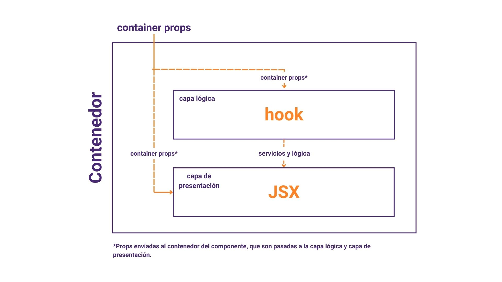

import { Steps } from 'nextra/components'

# Desarrollo de componentes

Los componentes son uno de los conceptos escenciales en el desarrollo con React. Son la base con la que se construyen aplicaciones y por este motivo, son el mejor lugar para empezar tu recorrido en este proceso.

**Aprenderás**

- Qué componentes y flujos ya están cubiertos con Ecommerce-plugin
- Arquitectura para creación de componentes
- Personalización de componentes
- ¿Cómo renderizar mi componente?

<Steps>

### Componentes y flujos de itg-ecommerce-plugin

itg-ecommerce-plugin es una librería de componentes contextos y funciones, orientada a aplicaciones e-commerce.

Su alcance cubre un producto minimo viable de una tienda. Dentro de este alcance encontrarás flujos como autenticación y registro, flujo de compra que incluye visualizacion de productos, añadir a carrito y pago. Administración de información del usuario como medios de pago o direcciones.

Para ver a más detalle todos los flujos, componentes y componentes ya existentes puedes revisar la sección de componentes.

### Arquitectura para creación de componentes

Existe una gran libertad en cuanto a cómo crear y manejar componentes. Para estandarizar el proceso de creación de componentes, proponemos el uso de la siguiente arquitectura



Esta arquitectura está compuesta por 3 capas

#### Contenedor del componente

Este es el punto central para el funcionamiento del componente. Recibe todas las propiedades necesarias para el funcionamiento correcto del componente, estas propiedades serán pasadas al **`hook`** del componente o a su renderizado.

Cuando un componente se requiera en otro archivo, se deberá usar el Contenedor como constructor de dicho componente.

#### Hook del componente

Esta capa contiene toda la funcionalidad del componente. Aquí se encuentran todos los estados, efectos y declaraciones de funciones. Todos estos valores son pasados, en caso de ser necesario, a la capa visual del componente.

#### Renderizado del componentre

La capa de renderizado o vista del componente se encarga de manejar el JSX de la aplicación, pintando los componentes de forma adecuada con la información que ha recibido tanto del contenedor como del hook del componente.

#### Implementación de un componente botón

Con el siguiente ejemplo, puedes visualizar esta arquitectura en código

```js
import React from 'react'

import { Button } from './Button'
import { useButton } from './useButtonText'

const ButtonContainer = ({ text }) => {
  const ButtonProps = useButton()

  return <ButtonText {...ButtonProps} text={text} />
}

export default ButtonContainer
```

Aquí, la función que ejecutaría **`Button`** deberá ser pasada por **`useButton`**. Mientras que el texto al interior del botón será pasado desde las props del **`contenedor`**.

Aprenderás todos los detalles de implementación de componentes en cómo crear un componente.

### Personalización de componentes

La apariencia visual y la experiencia de usuario son fundamentales al momento de desarrollar la UI de tu aplicación. Para facilitar este proceso podrás gestionar los estilos desde dos enfoques:

#### Estilos globales

Los estilos globales te permiten centralizar un conjunto de estilos que se usarán en toda tu aplicación. Este enfoque te permite mantener una consistencia, además de facilitar el mantenimiento de estilos en un solo lugar.

#### Estilos personalizados

Si deseas cambiar los estilos predeterminados de tus componentes o de los componentes de la librería e-commerce, los estilos personalizados son la herramienta perfecta. Puedes crear tus propias hojas de estilos y modificar las propiedades de estilos según tu preferencia y necesidades de tu proyecto.

Por ejemplo, si la hoja de estilos personalizada que creaste tiene las clase **`buttonClass`** y en ella defines las propiedades **`buttonContainer`** y **`buttonText`** puedes llamarlos desde tu **`JSX`** de de la siguiente manera

```js
import React from 'react'
import { TouchableOpacity, Text } from 'react-native'
import { useCustomStyles } from '...some-route'

const Button = ({ text, onPress }) => {
  const customStyles = useCustomStyles('buttonClass')
  return (
    <TouchableOpacity style={customStyles.buttonContainer} onPress={onPress}>
      <Text style={customStyles.buttonText}>{text}</Text>
    </TouchableOpacity>
  )
}
```

### ¿Cómo renderizar mi componente?

Para que puedas visualizar el componente que has creado deberás completar 2 pasos. El primero de ellos es registrar tu componente para que CORE pueda recibirlo. Encontrarás más detalles en registro de componentes, pero para entenderlo de forma rápida, el componente CORE puede recibir un listado de componentes custom, el pasar esos componentes a CORE es lo que llamamos proceso de registro.

Cómo habrás leido en Qué es CORE, uno de sus caracterisitcas principales es su inclinación a trabajar con sistemas de gestión de contenido. Así que una vez tu componente ha sido registrado, deberás añadirlo desde el CMS que estés usando y posicionarlo en una o más rutas, de acuerdo a tus necesidades.

</Steps>

## Recapitulación

Acabas de tener un primer vistado al proceso de creación y renderizado de componentes. Recapitulemos algunos puntos clave

- React te ofrece gran libertad al crear tus componentes, te recomendamos usar una arquitectura de contenedor, capa lógica y capa de presentación.
- Puedes personalizar tus componentes con una plantilla para toda tu app o crear estilos especificos para ciertos componentes.
- La estructura de tu aplicación está determinada por el CMS que estés usando, para renderizar los componentes que desees añadelos a las rutas desde el CMS.

## Proximos pasos

Continua con Creación de un componente para fortalecer tu entendimiento de la nueva arquitectura de componentes, tendrás la oportunidad de trabajar con ejemplos practicos usando estados y contextos.
