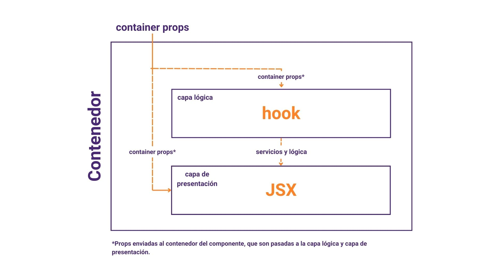
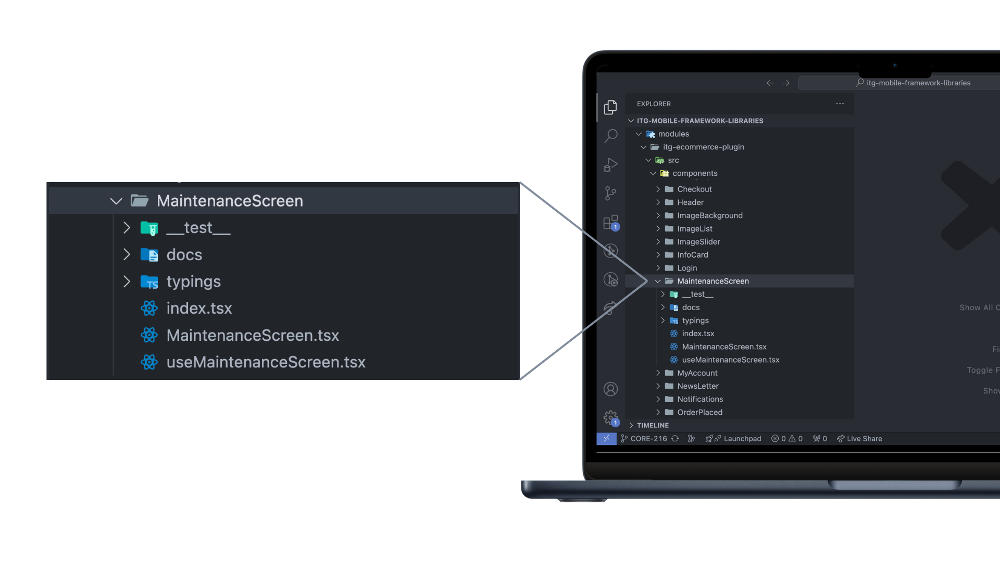
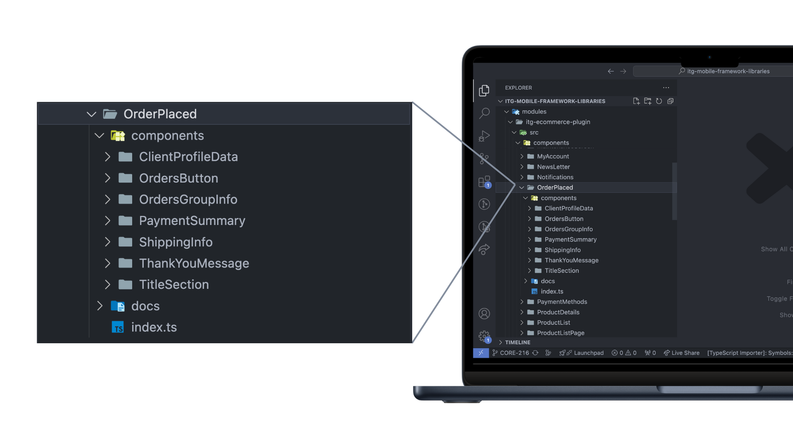
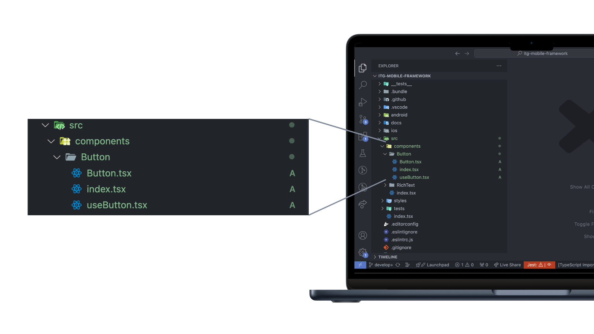

import { ExpoSnackEmbed } from '../../../components/ExpoSnackEmbed'
import YourFirstComponentFileTree from '../../../components/YourFirstComponentFileTree'

# Creación de un componente

Los componentes del core están basados en una arquitectura de 3 capas: capa contenedora, capa logica y capa de presentación. Esta arquitectura permite modularizar de forma sencilla tus componentes, mejorando su legibilidad, aumentando su flexibilidad y sentando las bases de un código fácil de testear.



**Aprenderás**

- Cuál es la estructura de carpetas para crear componentes
- Cómo crear un componente desde 0
- Cómo implementar hooks como useEffect o useContext dentro de tus componentes

## Estructura de carpetas y componentes

El proyecto en el que estarás trabajando tiene una carpeta components dentro del directorio src. En esta carpeta crearás todos tus componentes con la siguiente estructura



Cada nuevo componente tendrá su propia carpeta, en la cual 3 archivos prinicpales para el componente, **`index.tsx`**, **`Component.tsx`** y **`useComponent.tsx`**.

Como verás, además de los 3 archivos del componente, existen carpetas para algunas utilidades relacionadas al componente, como sus tipado, documentación y tests.

### Componentes relacionados

Puedes encontrarte en la necesidad de agrupar componentes que sean pequeñas partes de una misma funcionalidad. Si ese es el caso puedes crear una carpeta general en la cual almacenar todos esos componentes, en su interior crear una carpeta components y usar la estructura que apicamos arriba.



### Componentes con subcomponentes

Si tienes un componente individual que necesita de subcomponentes, puedes combinar las 2 estrategias vistas arriba. Crea la carpeta de tu componente con sus archivos base y las carpetas de utilidades y adiciona una carpeta de components y repite la misma estructura.

## Tu primer componente

Ya que conoces la arquitectura de componentes y su estructura de carpetas, crearás el siguiente slider de imagenes

<ExpoSnackEmbed snackId={'slider-component'} />

### Botones

Para empezar, en **`src/components`** crea una carpeta llamada **`Button`**. En su interior crea 3 archivos **`index.tsx`**, **`Button.tsx`** y **`useButton.tsx`**.



En **`index.tsx`** crearás tu componente contenedor. Para nombrar a tu componente contenedor, usar el nombre que hayas definido para tu componente, más el sufijo **`Container`**. En este caso el contenedor será **`ButtonContainer`**.

En **`ButtonContainer`** estará contenida tu capa lógica y tu capa de presentación.

```jsx
import React from 'react'

import { Button } from './Button'
import { useButton } from './useButton'

interface ButtonContainerProps {
  label: string;
  handlePress: () => void;
}

const ButtonContainer = (props: ButtonContainerProps) => {
  //const ButtonProps = useButton() // capa lógica

  return <ButtonText {...props} /> //capa de presentación
}

export default ButtonContainer
```

**¿Por qué la capa lógica está comentada?**

Para este ejercicio, tu componente button será reutilizable, de modo que la logica a ejecutar no estará definida en el componente sino que será pasada por props.

> Aunque algunos de tus componentes no requieran capa logica, procura mantener la arquitectura de componentes. Te ayudará a tener tu código organizado.

La capa de presentación de tu componente tendrá esta estructura

```jsx
import { StyleSheet, Text, TouchableOpacity } from 'react-native'

interface ButtonProps {
  label: string;
  handlePress: () => void;
}

const Button = ({ label, handlePress }: ButtonProps): JSX.Element => {
  const defaultStyles = StyleSheet.create({
    //...estilos
  })

  return (
    <TouchableOpacity
      style={defaultStyles.buttonContainer}
      onPress={handlePress}
    >
      <Text style={defaultStyles.buttonLabel}>{label}</Text>
    </TouchableOpacity>
  )
}

export default Button
```

> Si deseas ver los estilos del ejemplo, presiona en ver más del ejemplo.

Cuando importes tu componente ButtonContainer podría verse algo así

<ExpoSnackEmbed snackId={'button-component'} />

### Slider

Crea una nueva carpeta para un componente Slider dentro de **`src/components`**. Recrea la arquitectura de archivos para tu nuevo componente, de modo que tengas la siguiente estructura

<YourFirstComponentFileTree />
<br />

A continuación tienes el espacio para que puedas desarrollar tu mismo la logica y renderizado del slider. En este playground toda la estructura de funciones y paso de propiedades está listo para que puedas crear el código, y ver en tiempo real su funcionamiento.

**Desafío**

En la capa lógica:

- Desarrolla el código de los controladores **`goToNext`** y **`goToPrevious`**

En la capa de presentación:

- Asigna los controladores **`goToNext`** y **`goToPrevious`** a los botones que creaste anteriormente.
- Añade un componente imagen, y haz que la imagen renderizada cambie en respuesta a la interacción con los botones.
- Crea estilos y personaliza el **`Slider`** a tu preferencia.

<ExpoSnackEmbed snackId={'empty-snack'} />

Aunque en este ejercicio encontrarás que cada parte de la arquitectura de componentes está en el mismo archivo, en tu proyecto simplemente escribirás cada sección en su archivo correspondiente. [Aquí puedes ver el código del ejercicio]
(https://snack.expo.dev/@jhonperezitg101/slider-component).

### ¿Qué hacer en la capa lógica?

Al realizar el ejercicio anterior o revisar su solución podrás ver que aquellos componentes que requieren de uso de hooks de react, como **`useState`** en realidad se escriben de forma similar a otros componentes con los que has trabajado en otros proyectos, su principal diferencia es su organización, pues todos ellos se encuentran ahora en la capa lógica de tu componente.

Algunas operaciones comunes que podrás realizar en la capa lógica de tu componente son:

- Usar hooks de react (**`useState`**, **`useEffect`**)
- Crear los controladores que usará tu capa de presentación.
- Realizar peticiones de información
- Subscripción a contextos

### Recomendaciones para tus **`hooks`**

Aunque la capa lógica puede tener los estados y efectos de tu componente, quizá no siempre necesites un estado o un efecto. Algunas recomendaciones de react para determinar si necesitas o no un estado es responder estas preguntas. Haz este ejercicio con el componente slider que creaste:

1. ¿Se mantiene sin cambios con el tiempo? Si es así, no es estado.
   - El listado de imagenes se mantiene sin cambios durante el ciclo de vida del componente. Por lo que no necesitas un estado para almancenarlas.
   - La imagen actual del slider cambiará en respuesta a la interacción del usuario, por lo que necesitarás un estado para almacenar el indice de la imagen actual.
2. ¿Se pasa desde un padre por props? Si es así, no es estado.
   - El listado de imagenes se pasa como props a la capa contenedora, por lo que no es necesario crear un estado para ellas.
3. ¿Puedes calcularlo basado en estado existente on en props en tu componente? Si es así, ¡definitivamente no es estado!
   - Si a tu slider agregas unos **`dots`** de navegación, no es necesario almacenar en un estado el número de **`dots`** a crear pues puedes calcularlo a partir del largo del arreglo de imagenes pasadas a tu componente.

Puedes profundizar en estos conceptos en [Pensar en React](https://es.react.dev/learn/thinking-in-react), y si deseas aprender si tu componente necesita o no un efecto (**`useEffect`**) puedes revisar [You Might Not Need an Effect](https://react.dev/learn/you-might-not-need-an-effect).

## Recapitulación

Acabas de crear tu primer componente, recapitulemos algunos puntos clave

- Los componentes se desarrollan con una arquitectura de contenedor, capa lógica y capa de presentación.
- Algunos componentes, pueden no necesitar capa lógica pero procura mantener la su estructura de carpetas y archivos.
- Tu capa lógica será el lugar para almacenar tu estado, controlar efectos, crear controladores de eventos y realizar peticiones.
