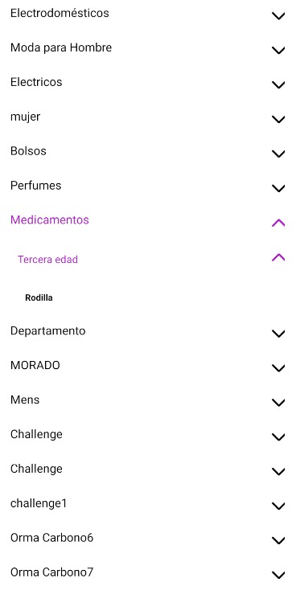

# Category Menu

The `CategoryMenu` component allows users to navigate through categories and subcategories in a store.

## Configuration

The `CategoryMenu` component exports the following props:

### `CategoryMenu` props

| Prop name          | Type         | Description                                                 | Default value |
| ------------------ | ------------ | ----------------------------------------------------------- | ------------- |
| `treeLevel`        | `number`     | The depth level of the category tree to render.             | `3`           |
| `showOnlySelected` | `boolean`    | Whether to show only the selected categories/subcategories. | `false`       |
| `categories`       | `Category[]` | An array of categories to render in the menu.               | `[]`          |
| `className`        | `string`     | Additional class name to apply custom styles.               | `""`          |

### `DropdownMenu` props

| Prop name          | Type                                                                  | Description                                                                                         | Default value |
| ------------------ | --------------------------------------------------------------------- | --------------------------------------------------------------------------------------------------- | ------------- |
| `renderColor`      | `RenderColorFunction`                                                 | A function to determine the color of the menu items based on the current level and selected values. | -             |
| `renderIcons`      | `RenderIconsFunction`                                                 | A function to render icons based on the current level, selected item, and selection color.          | -             |
| `selectedCategory` | `string \| null`                                                      | The ID of the selected category.                                                                    | `null`        |
| `currentLevel`     | `string`                                                              | The current level of the menu ('category' or 'subCategory').                                        | -             |
| `treeLevel`        | `number`                                                              | The depth level of the category tree. (max=3)                                                       | -             |
| `handlePress`      | `() => void`                                                          | A function to handle menu item press.                                                               | -             |
| `value`            | `{ id: string, name: string }`                                        | The ID and name of the category/subcategory.                                                        | -             |
| `styles`           | `{ baseStyles: Styles, customStyles: Styles, selectedColor: string }` | Custom styles for the menu.                                                                         | -             |

### `ItemDropdown` props

| Prop name      | Type                                           | Description                       | Default value |
| -------------- | ---------------------------------------------- | --------------------------------- | ------------- |
| `key`          | `string`                                       | The key of the item.              | -             |
| `item`         | `{ id: string, name: string }`                 | The item to render.               | -             |
| `redirectToFn` | `RedirectToFnFunction`                         | A function to handle redirection. | -             |
| `styles`       | `{ baseStyles: Styles, customStyles: Styles }` | Custom styles for the item.       | -             |

## Customization

In order to apply style customizations to the `CategoryMenu` component, follow the instructions given in the recipe on [Using className Handles for store customization](TODO: Link to styles hook docs).

| CSS Handles              |
| ------------------------ |
| `categoriesContainer`    |
| `categoriesText`         |
| `childCategoryText`      |
| `container`              |
| `subCategoriesContainer` |
| `subCategoriesText`      |

## Modus Operandi

The behavior of the `CategoryMenu` component varies based on the `treeLevel` and `showOnlySelected` props provided.
