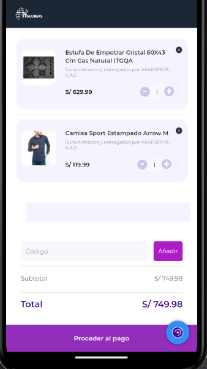

# CHECKOUT

The `Checkout` component is a WebView component that displays a checkout page specified by the provided URI.



## Configuration

The `Checkout` component exports the following props:

### `Checkout` props

| Prop name    | Type            | Description    | Default value                                                                                                                               |
| ------------ | --------------- | --------------------------------------------------------------------------------------------------------------------------------------------- | ---------- |
| `uri`      | `string`       | The URL of the checkout page to render         |         |


## Modus Operandi

To use the Checkout component, simply provide the uri prop with the URL of the checkout page to render. The uri should be formatted like this:

```ts
"https://www.example.com/checkout/?orderFormId=${orderFormId}"
```

Parameters should be enclosed within `${}`. In the application, these values will be replaced with those obtained from the local order form. Currently, _orderFormId_ and _email_ can be passed as parameters, but additional parameters required by the checkout URL can be added in the future.

## Customization

`For styling customizations in the Checkout component, you would typically rely on the styles provided by the webpage loaded within the WebView. As the Checkout component renders a webpage, any styling adjustments would be made directly within the webpage itself, rather than through the component's props or CSS handles.`
