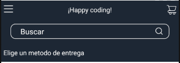
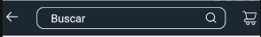
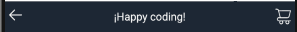

# Header

The `Header` component is a fundamental part of the user interface of an online store. It is located at the top of the screen and provides users with access to different key functionalities.

Subcomponents of the `Header`:

- `GoBack`: Allows the user to return to the previous screen.
- `GoCart`: Displays the number of items in the shopping cart and allows the user to access it.
- `SearchBar`: Allows the user to search for products by name, category, or description.
- `DeliveryInfo`: Displays information about the delivery method of the order, such as the estimated arrival time or the shipping cost.
- `Drawer`: Allows you to open a customizable content drawer.

## Configuration

The `Header` component exports the following props extends to `NativeStackHeaderProps` of @react-navigation/native-stack:

### `Header` props

| Prop name        | Type                           | Description                                   | Default value |
| ---------------- | ------------------------------ | --------------------------------------------- | ------------- |
| `variant`        | `'simple'  'complete'  'lite'` | variant of the header to render.              | `'complete'`  |
| `iconsColor`     | `string`                       | Color style for subcomponent icons.           | `'#fff'`      |
| `headerText`     | `string`                       | Text to render in the Header center.          | `undefined`   |
| `goBackText`     | `string`                       | Text to render in the go back button.         | `undefined`   |
| `goCartText`     | `string`                       | Text to render in the go cart button.         | `undefined`   |
| `menuText`       | `string`                       | Text to render in the menu button.            | `undefined`   |
| `className`      | `string`                       | Additional class name to apply custom styles. | `undefined`   |
| `drawerIcon`     | `string`                       | Icon to render open drawer.                   | `drawer`      |
| `closeIcon`      | `string`                       | Icon to render close drawer.                  | `close`       |
| `iconCloseColor` | `string`                       | Color style for close icons.                  | `undefined`   |
| `searchIcon`     | `string`                       | Icon to render in search button.              | `search`      |
| `goCarticon`     | `string`                       | Icon to render gocart button.                 | `cart`        |
| `goBackicon`     | `string`                       | Icon to render goback button.                 | `goBack`      |

## Customization

In order to apply style customizations to the `Header` component, follow the instructions given in the recipe on [Using className Handles for store customization](TODO: Link to styles hook docs).

| StyleSheet              |
| ----------------------- |
| `wrapper`               |
| `headerTitle`           |
| `headerRowContainer1`   |
| `headerRowContainer2`   |
| `headerRowContainer3`   |
| `goBackContainer`       |
| `goBackIcon`            |
| `goBackText`            |
| `goCartContainer`       |
| `goCartText`            |
| `goCartIcon`            |
| `drawerContainer`       |
| `drawerText`            |
| `drawerIcon`            |
| `modalBackground`       |
| `modalContainer`        |
| `closeContainer`        |
| `closeIcon`             |
| `searchBarContainer`    |
| `searchBarInput`        |
| `searchIcon`            |
| `deliveryInfocontainer` |
| `deliveryInfoText`      |

## Modus Operandi

The behavior of the `Header` component varies based on the `variant` props provided.

- `complete`
  
- `lite`
  
- `simple`
  
