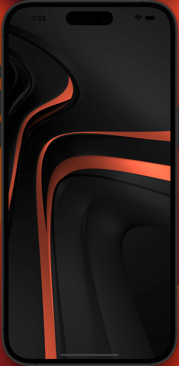

# BackgroundImage Component

A BackgroundImage is a versatile component that allows you to display an attractive background image at the start of your application or any other path. Its functionality allows you to load the image from a URL, adapting it to your needs. It can be used in conjunction with other components that render their content through a modal.

## Configuration

The following table shows the interface of the component, i.e. the properties through which you can control its appearance and behavior.

### `InfoCardProps` props

| Prop name          | Type      | Description                                                             | Default value |
| ------------------ | --------- | ----------------------------------------------------------------------- | ------------- |
| `image`         | `string`  | Url of the image that will be displayed as background                    | -             |
| `className`        | `string`  | Name of the class through which you can access the customization of styles.  | -             |

## Modus Operandi

This section outlines any behavioral changes that may occur depending on the configuration of the component. Currently, there are no specific behavioral changes to note.

## Customization

You can customize the appearance and behavior of the InfoCard component through the style handles found within the className property.

### Styles Handles

| Styles Handles             | Description |
| ----------------------- |-----------|
| `containerImage`       |You can set a background color to be displayed in case the image is not loaded or adjust the height and width of the image.|

