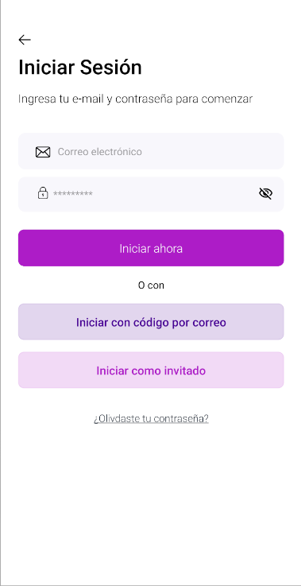

# OrchestratorSessions Component

The OrchestratorSessions component manages the orchestration of different screens within a store application. It dynamically renders either a login screen or a registration screen based on the provided configuration.

<!DOCTYPE html>
<html>
<head>

</head>
<body>

  
  

</body>
</html>

## Configuration

The following table lists the props exported by the OrchestratorSessions component along with their descriptions:

### `OrchestratorSessions` props

| Prop name       | Type            | Description                                                             | Default value |
| --------------- | --------------- | ----------------------------------------------------------------------- | ------------- |
| `route`         | `any`           | Route parameters containing props for determining the screen to display | -             |
| `screenByProps` | `ScreenByProps` | Object containing props for determining the screen to display.          | -             |
| `passwordRegex` | `RegExp`        | Regular expression for password validation.                             | -             |
| `className`     | `string`        | Custom CSS class name for styling purposes.                             | -             |

- `screenByProps` object:

| Prop name      | Type     | Description                          | Default value |
| -------------- | -------- | ------------------------------------ | ------------- |
| `screenToShow` | `string` | loginScreen or registerScreen option |               |

## LoginScreen Subcomponent

The `LoginScreen` subcomponent is responsible for rendering the login interface within the `OrchestratorSessions` component. It dynamically switches between different screens based on the current navigation stage.

### Props

| Prop name          | Type       | Description                                                | Default value |
| ------------------ | ---------- | ---------------------------------------------------------- | ------------- |
| `passwordRegex`    | `RegExp`   | Regular expression for password validation.                |               |
| `handleNavigation` | `function` | Function to handle navigation between screens.             |               |
| `className`        | `string`   | Additional CSS class names to be applied to the component. |               |

## EmailAndPasswordScreen Subcomponent

The `EmailAndPasswordScreen` subcomponent is responsible for rendering the email and password input fields within the login screen. It handles user input, validation, and submission of login credentials.

### Props

| Prop name                | Type       | Description                                                | Default value |
| ------------------------ | ---------- | ---------------------------------------------------------- | ------------- |
| `passwordRegex`          | `RegExp`   | Regular expression for password validation.                |               |
| `handleSubmit`           | `function` | Function to handle the submission of login credentials.    |               |
| `handleForgotPassword`   | `function` | Function to handle the "forgot password" action.           |               |
| `handlePasswordOnChange` | `function` | Function to handle changes in the password input field.    |               |
| `handleEmailOnChange`    | `function` | Function to handle changes in the email input field.       |               |
| `className`              | `string`   | Additional CSS class names to be applied to the component. |               |
| `errorMessageSubmit`     | `string`   | Error message to display in case of submission failure.    | `undefined`   |
| `isLoading`              | `boolean`  | Indicates whether the component is in a loading state.     | `false`       |

## Code By Email Subcomponent

This component provides the UI for users to input their email and receive a code.

### Props

| Prop name             | Type       | Description                                                        | Default value |
| --------------------- | ---------- | ------------------------------------------------------------------ | ------------- |
| `handleSubmit`        | `function` | Function to handle the submission of the email for receiving code. |               |
| `handleEmailOnChange` | `function` | Function to handle changes in the email input field.               |               |
| `handleNavigation`    | `function` | Function to handle navigation between screens.                     |               |
| `className`           | `string`   | Additional CSS class names to be applied to the component.         |               |
| `errorMessageSubmit`  | `string`   | Error message to display in case of submission failure.            |               |
| `isLoading`           | `boolean`  | Indicates whether the component is in a loading state.             | `false`       |

## OTP Screen Subcomponent

This component provides the UI for users to input the OTP and submit it for verification.

### Props

| Prop name            | Type       | Description                                                | Default value |
| -------------------- | ---------- | ---------------------------------------------------------- | ------------- |
| `handleNavigation`   | `function` | Function to handle navigation between screens.             |               |
| `className`          | `string`   | Additional CSS class names to be applied to the component. |               |
| `errorMessageSubmit` | `string`   | Error message to display in case of submission failure.    |               |
| `handleSubmit`       | `function` | Function to handle the submission of OTP for verification. |               |
| `handleOtpDispatch`  | `function` | Function to handle changes in the OTP input field.         |               |
| `handleResentOtp`    | `function` | Function to handle resending the OTP via email.            |               |
| `isLoading`          | `object`   | Indicates loading states for different actions.            | `{}`          |

- `isLoading` object:

| Prop name       | Type      | Description                           | Default value |
| --------------- | --------- | ------------------------------------- | ------------- |
| `resendLoading` | `boolean` | value to render the ActivityIndicator |               |
| `submitLoading` | `boolean` | value to render the ActivityIndicator |               |

## Recovery Password Screen Subcomponent

The Recovery Password Screen component allows users to recover their password by entering their email address to receive a recovery code.

### props

| Prop name             | Type       | Description                                                | Default value |
| --------------------- | ---------- | ---------------------------------------------------------- | ------------- |
| `className`           | `string`   | Additional CSS class names to be applied to the component. |               |
| `handleBack`          | `function` | Function to handle going back to the previous screen.      |               |
| `handleEmailOnChange` | `function` | Function to handle changes in the email input field.       |               |
| `handleSubmit`        | `function` | Function to handle the submission of the recovery request. |               |
| `errorMessageSubmit`  | `string`   | Error message to display in case of submission failure.    |               |
| `isLoading`           | `boolean`  | Indicates whether the component is in a loading state.     | `false`       |

- `isLoading` object:

| Prop name       | Type      | Description                           | Default value |
| --------------- | --------- | ------------------------------------- | ------------- |
| `resendLoading` | `boolean` | value to render the ActivityIndicator |               |
| `submitLoading` | `boolean` | value to render the ActivityIndicator |               |

## OTP Recovery Password Screen

The OTP Recovery Password Screen component allows users to recover their password by entering a recovery code received via email and setting a new password.

### Props

| Prop name                  | Type       | Description                                                         | Default value |
| -------------------------- | ---------- | ------------------------------------------------------------------- | ------------- |
| `className`                | `string`   | Additional CSS class names to be applied to the component.          |               |
| `handleNavigation`         | `function` | Function to handle navigation between screens.                      |               |
| `passwordRegex`            | `RegExp`   | Regular expression for password validation.                         |               |
| `handleCheckPassword`      | `function` | Function to validate the entered password.                          |               |
| `handlePasswordOnChange`   | `function` | Function to handle changes in the password input field.             |               |
| `handleSubmitStepPassword` | `function` | Function to handle the submission of the password recovery request. |               |
| `handleOtpDispatch`        | `function` | Function to handle the OTP dispatch.                                |               |
| `handleResentOtp`          | `function` | Function to handle the resent OTP request.                          |               |
| `errorMessageSubmit`       | `object`   | Error messages for password and OTP submission.                     | `{}`          |
| `isLoading`                | `object`   | Indicates whether the component is in a loading state.              | `{}`          |

- `isLoading` object:

  | Prop name       | Type      | Description                           | Default value |
  | --------------- | --------- | ------------------------------------- | ------------- |
  | `resendLoading` | `boolean` | value to render the ActivityIndicator |               |
  | `submitLoading` | `boolean` | value to render the ActivityIndicator |               |

## Customization

In order to apply style customizations in this and other blocks, follow the instructions given in the recipe on [Using className Handles for store customization](TODO: Link to styles hook docs).

---

This documentation provides a comprehensive overview of the OrchestratorSessions component, including its configuration options and guidance on customization. If you have any further questions or need assistance, feel free to ask!
