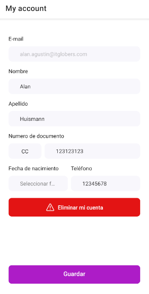

# MY ACCOUNT

The `MyAccount` component displays users' personal information such as their name, surname, document, date of birth, phone number, and more. Users can edit these information as needed. Additionally, there's a button that enable to delete their account.

## Configuration

The `MyAccount` component exports the following props:

### `MyAccount` props

| Prop name    | Type            | Description    | Default value                                                                                                                               |
| ------------ | --------------- | --------------------------------------------------------------------------------------------------------------------------------------------- | ---------- |
| `documentTypeOptions`      | `string[]`       | Array containing possible document types         |   `['CC', 'TI', 'Pasaporte']`      |
| `documentLengthValidation`      | `LengthValidation`       | Validation settings for document length         |        |
| `phoneNumberLengthValidation`      | `LengthValidation`       | Validation settings for phone number length         |         |
| `className`      | `string`       | Class name to apply custom styles         |         |

- `LengthValidation` object:

| Prop name    | Type            | Description    | Default value                                                                                                                               |
| ------------ | --------------- | --------------------------------------------------------------------------------------------------------------------------------------------- | ---------- |
| `maxLength`      | `number`       | Maximum length allowed for the document or phone number         |         |
| `minLength`      | `number`       | Minimum length required for the document or phone number         |        |

## Customization

`In order to apply style customizations in this and other blocks, follow the instructions given in the recipe on [Using className Handles for store customization](TODO: Link to styles hook docs).`

| CSS Handles |
| ----------- |
| `myAccountContainer` |
| `myAccountFormAndButtonContainer` |
| `myAccountFormSubmitButton` |
| `myAccountFormSubmitButtonText` |

> Also use CSS handles from the _PersonalInformationForm_ and  _DeleteAccountButton_ components.
