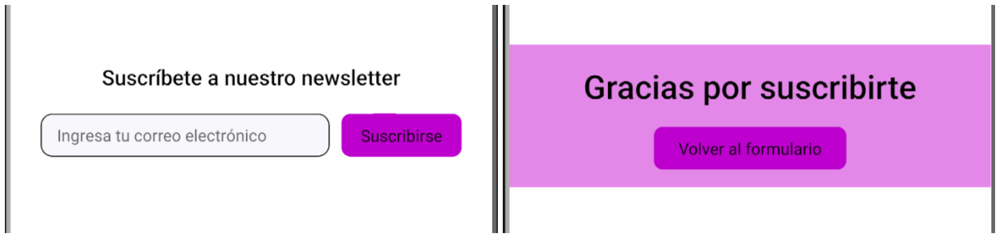

# Documentation for NewsLetterContainer Component

The `NewsLetterContainer` component is responsible for handling the logic related to a newsletter subscription form.



## Configuration

The following table shows the interface of the component, where we can find the properties through which its appearance can be controlled.

## Props

| Prop            | Description                                         | Default Value              | Type    |
|-----------------|-----------------------------------------------------|----------------------------|---------|
| `title`         | The title of the subscription form.                 | "Suscríbete a nuestro newsletter" | string |
| `placeholder`   | The placeholder text for the email input field.     | "Ingresa tu correo electrónico"         | string |
| `buttonText`    | The text for the subscription button.               | "Suscribirse"              | string |
| `thanksMessage` | The message displayed after the user subscribes.    | "Gracias por suscribirte"| string |
| `backButtonText`| The text for the button to go back to the form after seeing the thank you message. | "Volver al formulario" | string |
| `className`     | An optional CSS class to customize the styling of the component. | -          | string |

## Usage


```jsx
import NewsLetterContainer from './NewsLetterContainer'

const App = () => {
  return (
    <NewsLetterContainer
      title="Subscribe to our newsletter"
      placeholder="Enter your email"
      buttonText="Subscribe"
      thanksMessage="Thank you for subscribing"
      backButtonText="Back to form"
    />
  )
}

```

## Customization

You can customize the appearance of the newsletter component through the style handles found within the className property.

### Styles Handles

| Styles Handles          |
| ----------------------- |
| `containerNewsLetter`   |
| `containerInfo`         |
| `titleNewsLetter`       |
| `containerInputButton`  |
| `inputNewsLetter`       |
| `bottonNewsLetter`      |
| `containerThanksMessage`|
| `titleThanksMessage`    |
| `bottonGoBack`          |
| `error`                 |


