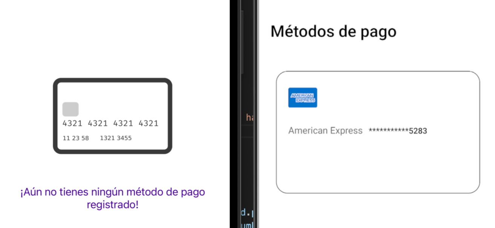

# Payment Methods 

The Payment Methods component displays a list of payment methods. If no payment methods are available, it shows a message indicating that no payment methods are available. The component accepts several properties that allow customization of its behavior and appearance.



### `PaymentMethods` props

| Prop name          | Type      | Description                                                             | Default value |
| ------------------ | --------- | ----------------------------------------------------------------------- | ------------- |
| `title`            | `string`  | The title displayed on the PaymentMethods                               | `Métodos de pago` |
| `textEmptyPayments`| `string`  | Title when no payment methods are available.                            |  `¡Aún no tienes ningún método de pago registrado!`|
| `className`        | `string`  | Name of the class through which you can access the customization of styles. | ----------|


```javascript
import React from 'react'
import { PaymentMethodsContainer } from './path/to/index'

const App = () => {
  return (
      <PaymentMethodsContainer
        className="customPaymentMethods"
        textEmptyPayments="No payment methods available"
        title="Available Payment Methods"
      />
  )
}
```

## Customization

You can customize the appearance and behavior of the PaymentMethods component through the style handles found within the className property.


| Styles Handles             |
| ----------------------- |
| `container`       |
| `containerText`                 |
| `title`       |
| `cardContainer`       |
| `titleContainer` |
| `cardNumber`    |
| `paymentSystemName`       |
| `containerIcons`                 |
| `emptyPaymentsContainer`       |
| `emptyPaymentsText`       |

