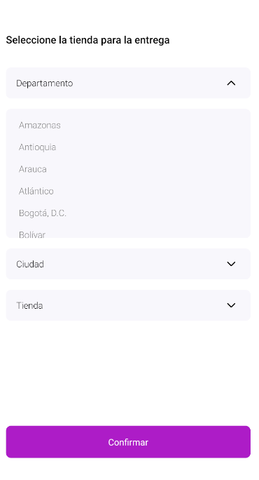

# PickupMethod Component

The `PickupMethod` component is used to display a method for picking up items in a React Native application. It provides a flexible interface for selecting pickup options based on country and postal code.



## Configuration

### PickupMethodContainer Props

| Prop name        | Type       | Description                                                                                                                                                                                                                                                            | Default value |
| ---------------- | ---------- | ---------------------------------------------------------------------------------------------------------------------------------------------------------------------------------------------------------------------------------------------------------------------- | ------------- |
| `className`      | `string`   | Custom class name to apply styles.                                                                                                                                                                                                                                     |               |
| `dropdownLevels` | `string[]` | Levels of dropdown menus titles and rendering identifiers based on the countryData structure. For example, if the countryData includes "Department", "City", and "Neighborhood", this array should contain these three titles along with the "Store" level at the end. |               |
| `countryData`    | `object`   | Data representing countries and their regions.                                                                                                                                                                                                                         |               |
| `iconOpenName`   | `string`   | Name of the icon component to display when the drawer is open.                                                                                                                                                                                                         |               |
| `iconCloseName`  | `string`   | Name of the icon component to display when the drawer is closed.                                                                                                                                                                                                       |               |
| `pickupTitle`    | `string`   | Title of the pickup method section.                                                                                                                                                                                                                                    |

- The `countryData` object contains nested key-value pairs representing different regions and their corresponding pickup locations with postal codes. Each region is further divided into sub-regions, and some sub-regions may contain additional levels of nesting.

For example:

```json
{
  "Beni": {
    "Cercado": {
      "Paititi": "10000",
      "Trinidad": "10001"
    },
    "Mamore": {
      "San Ramon": "10200"
    },
    "Moxos": {
      "San Ignacio de Moxos": "10300",
      "San Joaquin": "10301"
    }
  },
  "La Paz": {
    "Aroma": {
      "Ayo Ayo": "40000",
      "Capaja": "40001"
    },
    "Camacho": {
      "Escoma": "40100",
      "Mocomoco": "40101",
      "Puerto Acosta": "40102"
    },
    "Caranavi": {
      "Caranavi": "40200",
      "Taipiplaya": "40201"
    }
  }
}
```

dropdownLevels example for this case:

```ts
const dropdownLevels = ['Departamento', 'Municipio', 'Localidad', 'Tienda']
```

### PickupMethod Props

The PickupMethod component inherits all props from the PickupMethodContainer component, in addition to the following additional props

| Prop name              | Type       | Description                                                    | Default value |
| ---------------------- | ---------- | -------------------------------------------------------------- | ------------- |
| `toggleDrawer`         | `function` | Function to toggle the visibility of the drawer.               |               |
| `handleDropdownChange` | `function` | Function to handle changes in dropdown selection.              |               |
| `handleDrawerOptions`  | `function` | Function to handle drawer options based on dropdown selection. |               |
| `handleSubmit`         | `function` | Function to handle submission of selected pickup options.      |               |
| `dropdownOptions`      | `object`   | Options for dropdown menus.                                    |               |
| `isLoading`            | `boolean`  | Indicates whether the dropdown shop is in a loading state.     | `false`       |
| `isLoadingSubmit`      | `boolean`  | Indicates whether the submit button is in a loading state.     | `false`       |

## Modus Operandi

The `PickupMethod` component operates by rendering a series of dropdown menus based on the provided `dropdownLevels` and `countryData`. Users can select pickup options, and the component provides feedback through loading indicators when necessary.
