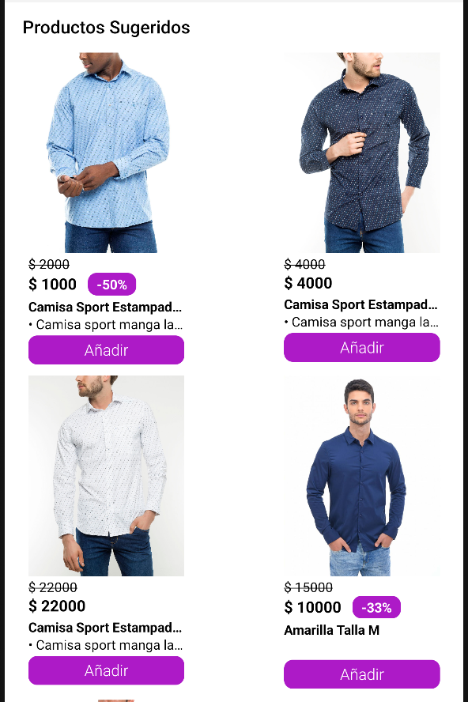

# ProductSuggestions

The `ProductSuggestions` is a component that displays suggested products based on the search term entered in the search bar and updates as the user types.

## Configuration

The `ProductSuggestions` component exports the following props

### `ProductSuggestions` props

| Prop name               | Type               | Description                                                                                    | Default value   |
| ----------------------- | ------------------ | ---------------------------------------------------------------------------------------------- | --------------- |
| `productWidth`          | `number \| string` | Width of the ProductSummary component                                                          | `150`           |
| `imageResizeMode`       | `string`           | Defines how the content of the product image adjusts within the container                      | `cover`         |
| `addToCartButton`       | `boolean`          | Controls the visibility of the add to cart button, allowing it to be shown or hidden as needed | `true`          |
| `textAddToCart`         | `string`           | Add to cart button text                                                                        | `Añadir`        |
| `textAvailability`      | `string`           | Add to cart button text when product is unavailable                                            | `No disponible` |
| `buttonActiveOpacity`   | `number`           | Add to cart button active opacity                                                              | `0.5`           |
| `className`             | `string`           | Class name to apply custom styles                                                              |                 |
| `requireAuthentication` | `boolean`          | Controls whether authentication is required or not.                                            |                 |
| `requireShippingMethod` | `boolean`          | Controls whether a delivery or store pickup method is required or not                          |                 |

## Customization

In order to apply style customizations to the `ProductSuggestions` component, follow the instructions given in the recipe on [Using className Handles for store customization](TODO: Link to styles hook docs).

| StyleSheet                       |
| -------------------------------- |
| `container`                      |
| `titleText`                      |
| `ProductSummaryContainer`        |
| `productContainer`               |
| `productImageContainer`          |
| `productImage`                   |
| `containerPrice`                 |
| `productListPrice`               |
| `containerPriceAndDiscount`      |
| `productPrice`                   |
| `productDiscount`                |
| `productName`                    |
| `productDescription`             |
| `productButtonContainer`         |
| `productButtonContainerDisabled` |
| `productButtonText`              |
| `productButtonTextDisabled`      |
| `productFlagsContainer`          |
| `productFlag`                    |

## Modus Operandi

The behavior of the `ProductSuggestions` component depends directly on the Searchbar. When entering a search term, pressing a result will redirect you to the product detail screen.
