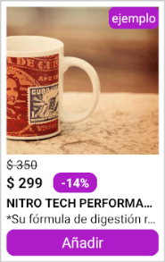

# PRODUCT SUMMARY

The `ProductSummary` component is designed to summarize product information (such as name, price, and image) for display in various sections of the store, such as shelfs or product list pages (PLP).

## Configuration

The `ProductSummary` component exports the following props:

### `ProductSummary` props

| Prop name    | Type            | Description    | Default value                                                                                                                               |
| ------------ | --------------- | --------------------------------------------------------------------------------------------------------------------------------------------- | ---------- |
| `product`      | `object`       | Product information         |         |
| `width`      | `number \| string`       | Width of the component         | `100%`        |
| `imageResizeMode`      | `string`       | Defines how the content of the product image adjusts within the container         | `cover`        |
| `addToCartButton`      | `boolean`       | Controls the visibility of the add to cart button, allowing it to be shown or hidden as needed       | `true`        |
| `textAddToCart`      | `string`       | Add to cart button text          | `Añadir`        |
| `textAvailability`      | `string`       | Add to cart button text when product is unavailable         | `No disponible`        |
| `buttonActiveOpacity`      | `number`       | Add to cart button active opacity         |    `0.5`    |
| `className`      | `string`       | Class name to apply custom styles         |         |

- `product` object: 

| Prop name          | Type                    | Description                                     | Default value |
| ------------------ | ----------------------- | ----------------------------------------------- | ------------- |
| `brand`            | `string`                | Brand of the product                            |               |
| `description`      | `string`                | Description of the product                      |               |
| `productId`        | `string`                | ID of the product                              |               |
| `items`            | `array`                | Array of SKU variations associated with the product     |               |
| `clusterHighlights`| `array`    | Array of cluster highlights related to the product |           |
| `properties`       | `array`            | Array of properties related to the product     |               |

- `items` array:

| Prop name     | Type         | Description                                        | Default value |
| ------------- | ------------ | -------------------------------------------------- | ------------- |
| `itemId`      | `string`     | ID of the item                                     |               |
| `images`      | `array`    | Array of images associated with the item           |               |
| `name`        | `string`     | Name of the item                                   |               |
| `sellers`     | `array`   | Array of sellers offering the item                 |               |

- `images` array:

| Prop name        | Type                | Description                                     | Default value |
| ---------------- | ------------------- | ----------------------------------------------- | ------------- |
| `imageUrl`       | `string`            | Url of the item image                                |               |

- `sellers` array:

| Prop name        | Type                | Description                                     | Default value |
| ---------------- | ------------------- | ----------------------------------------------- | ------------- |
| `sellerId`       | `string`            | ID of the seller                                |               |
| `sellerName`     | `string`            | Name of the seller                              |               |
| `commertialOffer`| `array`   | Commercial offer details of the seller          |               |

- `commertialOffer` array:

| Prop name           | Type       | Description                                           | Default value |
| ------------------- | ---------- | ----------------------------------------------------- | ------------- |
| `Price`             | `number`   | Price of the item                                     |               |
| `ListPrice`         | `number`   | List price of the item                                |               |
| `AvailableQuantity` | `number`   | Available quantity of the item                        |               |
| `DiscountPercentage`| `number`   | Percentage of discount applied to the item |               |

- `clusterHighlights` array:

| Prop name  | Type     | Description                              | Default value |
| ---------- | -------- | ---------------------------------------- | ------------- |
| `id`       | `any`    | ID of the cluster highlight               |               |
| `name`     | `any`    | Name of the cluster highlight             |               |

- `properties` array:

| Prop name  | Type         | Description                              | Default value |
| ---------- | ------------ | ---------------------------------------- | ------------- |
| `name`     | `string`     | Name of the property                      |               |
| `values`   | `string[]`   | Array of values associated with the property |            |

## Customization

`In order to apply style customizations in this and other blocks, follow the instructions given in the recipe on [Using className Handles for store customization](TODO: Link to styles hook docs).`

| CSS Handles |
| ----------- |
| `productContainer` |
| `productImageContainer` |
| `productImage` |
| `containerPrice` |
| `productListPrice` |
| `containerPriceAndDiscount` |
| `productPrice` |
| `productDiscount` |
| `productName` |
| `productDescription` |
| `productButtonContainer` |
| `productButtonContainerDisabled` |
| `productButtonText` |
| `productButtonTextDisabled` |
| `productFlagsContainer` |
| `productFlag` |
