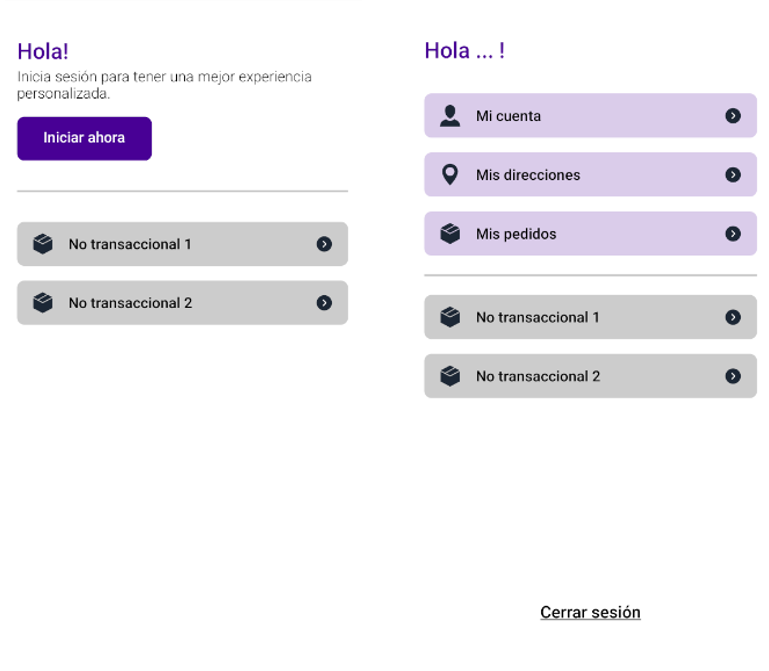

# PROFILE

The `Profile` component contains a menu with redirects to essential user information such as personal details, order history, saved addresses, and customizable settings options.

## Configuration

The `Profile` component exports the following props:

### `Profile` props

| Prop name    | Type            | Description    | Default value                                                                                                                               |
| ------------ | --------------- | --------------------------------------------------------------------------------------------------------------------------------------------- | ---------- |
| `menuOptions`      | `array`       | Array containing menu options         |         |
| `unloggedText`      | `string`       | Text displayed on the screen when the user is not logged in         |    `Inicia sesión para tener una mejor experiencia personalizada.`     |
| `className`      | `string`       | Class name to apply custom styles         |         |

- `menuOptions` array:

| Prop name    | Type            | Description    | Default value                                                                                                                               |
| ------------ | --------------- | --------------------------------------------------------------------------------------------------------------------------------------------- | ---------- |
| `name`      | `string`       | Name of the menu option         |         |
| `link`      | `object`       | Object defining the link of the menu option         |         |
| `type`      | `string`       | Indicates whether the menu option is `primary` or `secondary`, determining its order in the menu         |         |
| `icon`      | `string`       | Icon associated with the menu option         |         |

- `link` object:

| Prop name    | Type            | Description    | Default value                                                                                                                               |
| ------------ | --------------- | --------------------------------------------------------------------------------------------------------------------------------------------- | ---------- |
| `url`      | `string`       | URL of the link         |         |
| `external`      | `boolean`       | Indicates if the link is external (optional)         |   false      |

## Modus Operandi

Consider the following when using the component:

- The component behaves differently depending on whether the user is logged into the app or not. When logged in, a welcome message is displayed along with the defined menu options and a logout button. If the user is not logged in, a text appears along with secondary menu options (if any), which refer to non-transactional pages such as additional information or terms and conditions, etc. Additionally, there is a button that redirects to the login screen for the user to log in.

- If no menu options are provided, the component will display the default options. These default options include: `"My Account"`, `"My Addresses"` and `"My Orders"`.

- If you want to customize the container for a specific menu option, use the `optionContainerPrimary` or `optionContainerSecondary` class followed by a number, indicating the position of the option you want to customize on the menu. Example: `optionPrimaryContainer1`

## Customization

`In order to apply style customizations in this and other blocks, follow the instructions given in the recipe on [Using className Handles for store customization](TODO: Link to styles hook docs).`

| CSS Handles |
| ----------- |
| `profileContainer` |
| `profileTitle` |
| `logoutButtonContainer` |
| `logoutButton` |
| `logoutButtonText` |
| `profileTitle` |
| `unloggedText` |
| `loginButton` |
| `loginButtonText` |
| `profileMenuContainer` |
| `profileMenuPrimaryOptions` |
| `profileMenuSecondaryOptions` |
| `optionContainer` |
| `optionContainerPrimary` |
| `optionContainerSecondary` |
| `optionIconAndName` |
| `optionIconContainer` |
| `optionIcon` |
| `optionName` |
| `arrowIconContainer` |
| `arrowIcon` |
