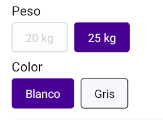

# SKU SELECTOR

The `Sku Selector` component is a versatile tool that allows users to select SKU variations for products, whether they are viewing a product detail page or browsing through a product list. It enhances the shopping experience by providing an intuitive interface for selecting product options such as color, size, etc.

## Configuration

The `Sku Selector` component exports the following props:

### `Sku Selector` props

| Prop name    | Type            | Description    | Default value                                                                                                                               |
| ------------ | --------------- | --------------------------------------------------------------------------------------------------------------------------------------------- | ---------- |
| `variant`      | `'product-list' \| 'product-detail'`       | Determines where component will be rendered, either in a product detail or list       |         |
| `className`      | `string`       | Class name to apply custom styles         |         |

## Modus Operandi

The modus operandi of the Sku Selector component varies depending on the context in which it is used:

- Product Detail: When used on a product detail page, the Sku Selector renders directly within the screen, allowing users to select SKU variations seamlessly. Use the context of the Product Detail.

- Product List: When used within a product list, the Sku Selector appears as a modal that is triggered by clicking the "Add to Cart" button. This modal provides an interface for selecting the desired SKU variations before adding the product to the cart. Use the context of the Product Summary

## Customization

`In order to apply style customizations in this and other blocks, follow the instructions given in the recipe on [Using className Handles for store customization](TODO: Link to styles hook docs).`

| CSS Handles |
| ----------- |
| skuSelectorContainer |
| skuSpecificationContainer |
| skuSpecificationTitle |
| skuSpecificationValuesContainer |
| skuSpecificationValue |
| skuSpecificationSelectedValue |
| skuSpecificationValueDisabled |
| skuSpecificationValueText |
| skuSpecificationSelectedValueText |
| productSkuModalImageAndInfo |
| productSkuModalImageContainer |
| productSkuModalImage |
| productSkuModalInfo |
| productSkuModalBrandAndName |
| productSkuModalBrand |
| productSkuModalName |
| productSkuModalPriceContainer |
| productSkuModalPriceAndDiscount |
| productSkuModalPrice |
| productSkuModalDiscount |
| productSkuModalListPrice |
| productSkuModalButtons |
| productSkuModalViewMoreContainer |
| productSkuModalViewMoreText |

