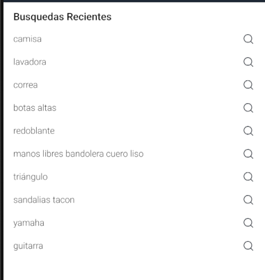

# TopSearches

The `TopSearches` is a component that displays Top terms searches.

## Configuration

The `TopSearches` component exports the following props

### `TopSearches` props

| Prop name    | Type     | Description                         | Default value |
| ------------ | -------- | ----------------------------------- | ------------- |
| `className`  | `string` | Class name to apply custom styles   |               |
| `title`      | `string` | text to rendered in title           |               |
| `searchIcon` | `string` | Icon to render.                     | `search`      |
| `iconColor`  | `string` | Color style for subcomponent icons. | `undefined`   |

## Customization

In order to apply style customizations to the `TopSearches` component, follow the instructions given in the recipe on [Using className Handles for store customization](TODO: Link to styles hook docs).

| StyleSheet      |
| --------------- |
| `container`     |
| `titleText`     |
| `text`          |
| `searchIcon`    |
| `itemContainer` |

## Modus Operandi

The behavior of the `TopSearches` component depends directly on the search bar. When entering a search term, the most searched terms are hidden to give priority to autocomplete components, pressing a Topsearches term will redirect you to the search screen.
