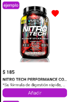

# WishListButton

The `WishListButton` is a component which provides the ability to add or remove a product to the favorites list.

## Configuration

The `WishListButton` component exports the following props

### `WishListButton` props

| Prop name   | Type     | Description                       | Default value |
| ----------- | -------- | --------------------------------- | ------------- |
| `className` | `string` | Class name to apply custom styles |               |
| `iconName`  | `string` | Icon to render.                   | `favorite`    |

## Customization

In order to apply style customizations to the `WishListButton` component, follow the instructions given in the recipe on [Using className Handles for store customization](TODO: Link to styles hook docs).

| StyleSheet  |
| ----------- |
| `container` |

## Modus Operandi
