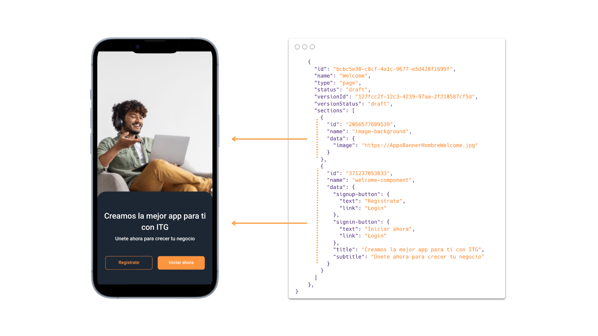

# CMS

Esta pagina te dará una explicación completa de la integración entre CORE y CMS.

## Aprenderás

- Porqué necesitas un CMS
- Qué contenidos se gestionan desde un CMS
- Cómo desarrollar para un CMS
- Cómo configurar tu CMS

## Tu App en bloques

Las aplicaciones desarrolladas con CORE tienen una fuerte inclinación a trabajar con sistemas de gestión de contenidos para definir la estructura tanto de rutas como de componentes.

Al trabajar estrechamente con un CMS puedes pensar tu aplicación como un conjunto de pequeños bloques que puedes usar para construir lo que necesites. Así, podrás quitar y poner componentes, o incluso crear y borrar secciones completas de la aplicación según requieras.

Desarrollar tu aplicación de esta forma te ofrecerá grandes ventajas:

- Las modificaciones de bloques, rutas o componetes, que hagas se darán en tiempo real
- No deberás compilar o desplegar nuevamente tus aplicaciones
- Podrás usar tus componentes según necesites en diferentes partes de la aplicación

## Qué administra Tu CMS

El CMS estará encargado de dar la estrucutra de tu aplicación, lo que incluye qué rutas tendrá y que componentes conformará cada una de esas rutas.

El alcance de tu CMS no termina allí, pues podrás configurar cómo se ven o se comportan diferetes componentes. En un componente slider de imagenes, podrás definir qué imagenes mostrar, pero también podrás personalizar su comportamiento como cuantas imagenes mostrar o si tiene autoplay.

Veamos un ejemplo. Tienes una ruta llamada **`Welcome`** que es el punto de entrada de tu aplicación. Aquí deseas mostrar una imagen de fondo, acompañada de un componente que permita al usuario registrarse o autenticarse para entrar a una tienda. Lo que acabamos de describir podría verse así desde tu CMS:



Como ves, no solo se define la estructura de los componentes, sino también detalles o propiedades de los mismos, como los textos que tiene en su interior.

### Desarrolla tus componentes para un CMS

Al momento de crear componentes, desarrollalos para que puedan ser usados y administrados desde un CMS, habilitando las opciones necesarias para que pueda ser personalizado por fuera del código.

#### **¿Qué tan personalizable debe ser mi componente?**

🚧 sección aún en construcción

**`welcome-component`** es uno de los componentes de **`Welcome`** y te ayudará a responder esta pregunta. Este componente pinta un titulo, un subtitulo y dos botones. La interfaz minima necesaria para que este componente sea personalizable debe incluir esos mismos elementos: un titulo, un subtitulo y dos botones que también incluirán el texto al interior del botón y su enlace de redirección.

Al listado de opciones de personalización podriamos añadir muchos mas elementos como: que tan redondeado es el borde del contenedor, color y fuente de titulos y subtitulos, color de fondo de los botones y más.

Si bien el nivel de pesonalización de tus componentes puede ser muy alto e incluir todas las opciones que acabamos de mencionar, es bueno que te preguntes ¿Cuales son las propiedades que necesita mi componente para funcionar? en el caso de **`welcome-componente`** los botones y sus enlaces de redirección son la parte más importante, seguido de titulo y subtitulo.

## Cómo configurar tu CMS

CORE está usando [VTEX Headless CMS](https://help.vtex.com/es/tutorial/headless-cms-visao-geral--3U5gvhHdQL0jczYH8gjX09). Esto no significa que este ligado a este CMS, CORE fue pensado para tener la libertad de conectarse al CMS que requiera tu aplicación. Pero ten presente que una parte de la configuración que verás a continuación está planteada para este CMS.

> La conexión a otros CMS deberá pasar por el desarrollo de un plugin que permita conectarse a esos CMS.

## Configuración de fetch con CMS-Plugin

La configuración para conectarte a tu CMS se establece en el siguiente plugin. En el podrás configurar todo lo relacionado a conexión y petición de información a tu CMS.

```jsx
const plugins = [
  //... otros plugins
  {
    resolve: `itg-cms-plugin`,
    options: {
      provider: `vtex`,
      variables: {
        accountName: `itglobers`,
        workspace: `app`,
        builderId: `app`,
        contentType: `page`,
      },
    },
  },
  //... otros plugins
]
```

### resolve

Es el plugin de CMS que se usará. CORE se integra **`itg-cms-plugin`**. Resolve no deberá confundirse con el proveedor de CMS a usar.

### options

| Propiedad    | Tipo                          | Descripción             |
| ------------ | ----------------------------- | ----------------------- |
| provider     | string                        | Proveedor de CMS a usar |
| variables    | [Variables](#variables)       | Variables               |
| retryOptions | [retryOption](#retryoptions)  | Opciones de reintento   |
| fetchOptions | [fetchOptions](#fetchoptions) | Opciones de fetch       |

#### Variables

Las **`variables`** te permiten configurar la URL para la petición a tu CMS. Para [VTEX Headless CMS](https://help.vtex.com/es/tutorial/headless-cms-visao-geral--3U5gvhHdQL0jczYH8gjX09), por ejemplo, necesitarás variables para definir el **`accountName`** o **`workspace`**.

| Propiedad | Tipo   | Descripción          |
| --------- | ------ | -------------------- |
| key       | string | Clave de la variable |
| value     | string | Valor de la variable |

#### retryOptions

El objeto **`retryOptions`** te permite definir la cantidad de reintentos de conexión en caso de que la conexión al CMS falle. Estas opciones pueden serte de utilidad si tu servidor se desactiva tras un periodo de inactividad.

| Propiedad  | Tipo   | Descripción                   |
| ---------- | ------ | ----------------------------- |
| maxRetries | number | Número máximo de reintentos   |
| retryDelay | number | Retardo entre reintentos (ms) |

#### fetchOptions

El objeto **`fetchOptions`** contiene configuraciones que permiten personalizar tu solicitud. Para ver todas las opciones disponibles de configuración revisa la [propiedad init del método fetch](https://developer.mozilla.org/es/docs/Web/API/fetch##init).

| Propiedad | Tipo                            | Descripción                 |
| --------- | ------------------------------- | --------------------------- |
| key       | string                          | Clave de la opción de fetch |
| value     | string o Record<string, string> | Valor de la opción de fetch |

## Configuración de rutas con ITG-ECOMMERCE Plugin

Si deseas configurar opciones relacionadas con las rutas de tu aplicación podrás hacerlo con **`itg-ecommerce-plugin`**.

Ya que CMS también maneja las rutas de tu aplicación, si deseas configurar algo relacionado con las rutas debes ir al e-commerce plugin. en la sección routesConfig

```jsx
const plugins = [
  //... otros plugins
  {
    resolve: `itg-ecommerce-plugin`,
    options: {
      //... opciones
    },
    routesConfig: {
      initialRouteName: {
        loggedIn: 'Home',
        loggedOut: 'Welcome',
      },
      routes: [
        {
          name: 'Welcome',
          options: {
            headerShown: false,
            showTabNavigator: false,
            loggedIn: false,
          },
        },
        {
          name: 'Login',
          options: {
            headerShown: false,
            showTabNavigator: false,
            loggedIn: false,
          },
        },
        {
          name: 'Checkout',
          options: {
            headerShown: false,
            useDefaultLayout: false,
            showTabNavigator: false,
          },
        },
        {
          name: 'Profile',
          options: {
            useDefaultLayout: false,
          },
        },
      ],
    },
  },
  //... otros plugins
]
```

### routesConfig

**`routesConfig`** es un objeto que te permitirá personalizar diferentes opciones de tus rutas, definir ruta inicial y más.

| Propiedad        | Tipo                                  | Descripción               |
| ---------------- | ------------------------------------- | ------------------------- |
| initialRouteName | [InitialRouteName](#initialroutename) | Nombre de la ruta inicial |
| routes           | [routes](#routes)                     | Arreglo de rutas          |

#### InitialRouteName

Permite definir cual es la ruta inicial de tu aplicación, dependiendo del estado los estados **`loggedIn`** o **`loggedOut`**.

| Propiedad | Tipo   | Descripción                             |
| --------- | ------ | --------------------------------------- |
| loggedIn  | string | Ruta inicial para usuarios logueados    |
| loggedOut | string | Ruta inicial para usuarios no logueados |

#### Routes

Listado de rutas de tu aplicación.

> Este listado no debe contener todas las rutas de tu aplicación, sino aquellas a las que desees cambiar alguna de sus **`Options`**.

| Propiedad | Tipo    | Descripción         |
| --------- | ------- | ------------------- |
| name      | string  | Nombre de la ruta   |
| options   | Options | Opciones de la ruta |

#### Options

| Propiedad        | Tipo    | Descripción                                               | Valor por defecto |
| ---------------- | ------- | --------------------------------------------------------- | ----------------- |
| headerShown      | boolean | Indica si se muestra el componente Header                 | true              |
| showTabNavigator | boolean | Indica si se muestra el componente TabNavigator           | true              |
| loggedIn         | boolean | Indica si la ruta está disponible para usuarios logueados | true              |
| useDefaultLayout | boolean | Indica si se usa el Layout por defecto                    | true              |

> **headerShown** y **showTabNavigator** hacen referencia a los componentes de e-commerce-plugin o tus componentes header y tabBar en caso de que los hayas customizado. No hacen referencia a los componentes por defecto de la librería [React Navigation](https://reactnavigation.org/).

**useDefaultLayout** te permite desactivar el layout por defecto. Este layout consiste de un **`ScrollView`** y un **`SafeAreaView`** que envuelven los componentes que hayas definido para esa ruta. Puedes considerar desactivarlos en el caso de que alguno de los componentes que hayas definidio de dicha ruta incluya un **`ScrollView`** o una **`FlatList`** en sentido vertical, lo que rompe con las reglas de react native y causa errores que afectan el rendimiento normal de tu aplicación.
