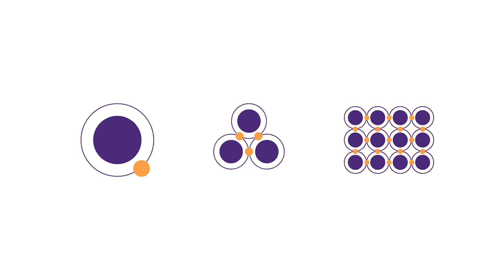

import { Callout } from 'nextra/components'

# E-COMMERCE

Al iniciar tu proyecto desde la plantilla que creaste en configuracion de ambiente, encontrarás una aplicación de comercio electrónico completamente funcional. Esta aplicación incluye todos los flujos comunes para un e-commerce que use la plataforma [VTEX](https://developers.vtex.com/). Esta aplicación está construida en su totalidad con **`itg-ecommerce-plugin`**.

**`itg-ecommerce-plugin`** es una biblioteca de componentes, contextos y funciones, listos para usar. Esta biblioteca te ofrece desde componentes minimos como **`rich-text`** o **`icons`**, pasando por componentes de complejidad media como **`sliders`** o **`menu`** hasta un nivel de secciones complejas que trabajan en conjunto para un proposito particular, como todos los componentes que conformar una **`PDP`** (Página de Detalles del Producto). De este modo, esta biblioteca sigue una estructura similar al diseño atómico.



## Casos de uso

Además de brindarte una solución para tener una aplicación completamente construida, puedes beneficiarte de e-commerce en algunos casos como

### Personalización de componentes

Todos los componentes de la plantilla de tu aplicación tienen cierto nivel de personalización. Esta personalización podrás hacerla a traves de tu CMS usando las interfaces de los componentes o mediante el uso de clases de estilos para personalizar los estilos de tu aplicación.

### Funciones

Si creas un componente Custom y este debe hacer una solicitud de datos al servidor, tienes también un listado de funciones que te permitirán utilizar diferentes servicios.

Por ejemplo, si debes desarrollar un menú de categorías con alguna funcionalidad muy particular. Existe una función que te permite consultar el servicio del menú de categorías para que dispongas de esa información de inmediato y te centres en lo más relevante del desarrollo de tu nuevo componente.

### Contextos

En algunos casos, los componentes custom que crearás no serán componentes aislados, sino que harán parte de alguna sección de tu aplicación, como una **`PDP`**.

Para este tipo de desarrollos, no hará falta que uses, por ejemplo, una función para consultar los detalles de un producto ya que todos los datos relacionados a esa consulta ya han sido solicitados y están disponibles en un contexto. Podrás suscribirte a ese contexto para consultar la información que existe en él o incluso enviar acciones para actualizarlo.

Podrás encontrar todos los contextos disponibles en contextos.

## Configuración de E-COMMERCE

La configuración por defecto de tu **`itg-ecommerce-plugin`** es la siguiente:

| Propiedad | Tipo                | Descripción         |
| --------- | ------------------- | ------------------- |
| resolve   | string              | Nombre del plugin   |
| options   | [options](#options) | Opciones del plugin |

```jsx
const plugins = [
  //...otros plugins
  {
    resolve: `itg-ecommerce-plugin`,
    options: {
      provider: `vtex`,
      account: `itglobers`,
      workspace: `master`,
      culture: {
        country: 'COL',
        currency: 'COP',
        customCurrencyDecimalDigits: 0,
        customCurrencySymbol: '$',
        language: 'es',
        locale: 'es-CO',
      },
      routesConfig: {
        //... configuración de rutas
      },
    },
  },
]
```

### Options

<Callout type="warning" emoji="⚠️">
  Las siguientes propiedades de configuración son especificas para conectarse
  con VTEX, debido a que este es el único provider disponible hasta el momento.
</Callout>

| Propiedad | Tipo                | Descripción                        |
| --------- | ------------------- | ---------------------------------- |
| provider  | string              | Proveedor de e-commerce a utilizar |
| account   | string              | Cuenta                             |
| workspace | string              | Espacio de trabajo                 |
| culture   | [culture](#culture) | Información cultural y monetaria   |

El provider que usa el template de tu aplicación es **`vtex`**. Para este proveedor, los valores **`account`** y **`provider`** son usados de forma constante para construir la URL de las peticiones de tus componentes de la siguiente forma

```jsx
const response = await fetcher(
  `https://${account}.myvtex.com/_v/public/graphql/v1?workspace=${workspace}`,
  {
    method: 'POST',
    body,
  }
)
```

Si deseas apuntar a otra **`account`** o **`workspace`** este es el espacio para realizar ese cambio.

#### Culture

| Propiedad                   | Tipo   | Descripción                      |
| --------------------------- | ------ | -------------------------------- |
| country                     | string | País                             |
| currency                    | string | Moneda                           |
| customCurrencyDecimalDigits | number | Dígitos decimales personalizados |
| customCurrencySymbol        | string | Símbolo de moneda personalizado  |
| language                    | string | Idioma                           |
| locale                      | string | Configuración regional           |
