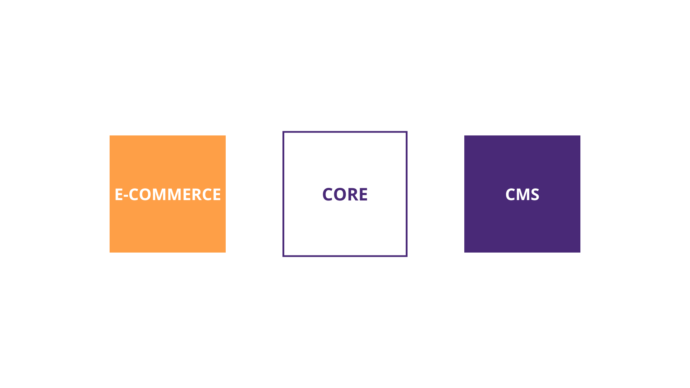

# ¿Qué es Core?

## CORE: Un vistazo interno

Si bien para ti CORE puede sentirse como una caja negra en este momento, en las siguientes secciones lograrás comprender su funcionamiento y cómo sacarle el máximo provecho posible.

Antes de continuar, debes entender que CORE es en realidad un conjunto de librerías, que trabajan en conjunto para facilitar el proceso de desarrollo. En cada una de las siguientes secciones aprenderás los conceptos más relevantes de cada librería y cómo configurarlas.

> Todas sus configuraciones las harás integrando plugins al archivo **`plugins.config.js`** ubicado en la raíz de tu proyecto.