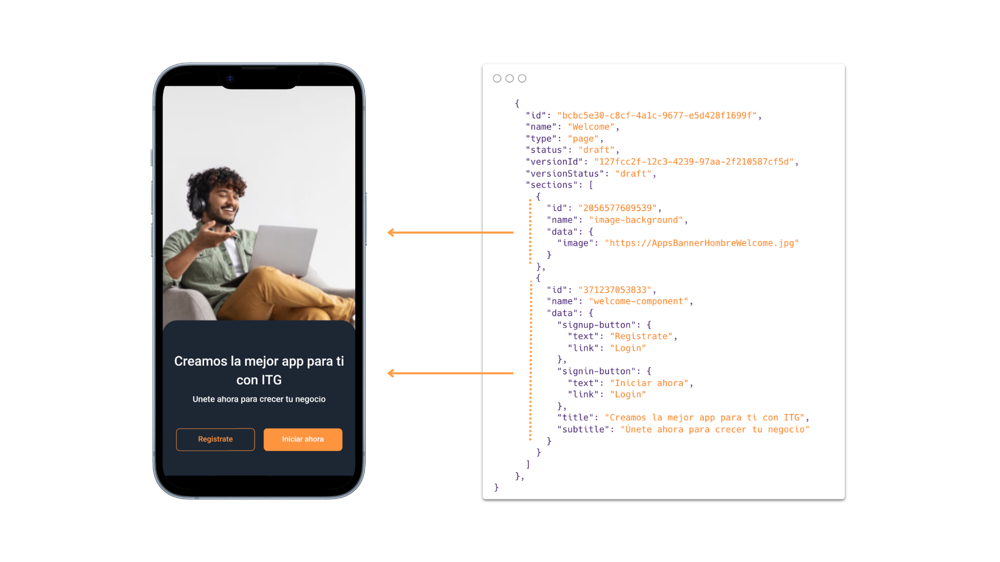

import { Callout } from 'nextra/components'

# Configuración de tienda

El set-up inicial es el proceso de cargar las interfaces de todos los componentes de tu aplicación, ya sean personalizados o de **`itg-ecommerce-plugin`**. Estas interfaces son cargadas al CMS de tu proyecto, y desde él se crearán todas las rutas que tendrá tu aplicación y se definirán los componentes de dichas rutas.

En esta sección aprenderás

- Cómo está configurado el template de este proyecto
- Qué son interfaces de componentes
- Cómo crear las interfaces de tus componentes
- Cómo hacer un set-up inicial de un proyecto

## ¿Cómo está configurado el template de este proyecto?

La tienda que visualizas al iniciar el proyecto, es un set-up inicial creado usando los servicios de Headless CMS de VTEX.

Headless CMS ofrece la posibilidad de crear interfaces para tus componentes y desde un admin panel te permite llamar y personalizar sos componentes de forma sencilla.

### Modifica el set-up de tu proyecto

Puedes modificar el set-up el proyecto de dos formas

1. Haz modificaciones desde tu CMS, añadindo o eliminando componentes o rutas. Y para una personalización más detallada, cambia propiedades especificas de tus componentes.
2. Añade nuevos componentes a tu CMS.

### Añadir nuevos componentes

El uso de Headless CMS de VTEX se realiza a traves de un servicio custom, por lo que deberás notificiar al equipo del framework para que añadan el componente que has creado.

Para este proceso lo más relevante es que tengas la interfaz de tu componente, que es la que definirá que elementos se pueden personalizar (si los tiene) y que tipo de valores son requeridos para esa personalización.

En la sección [¿Qué son interfaces?](#qué-son-interfaces) aprenderás los conceptos más relevantes al momento de crear interfaces para que tus componentes puedan ser usados desde un CMS.

> ❗ Este proceso puede sufrir modificaciones dependiendo del servicio de CMS que estés utilizando. La información proporcionada hasta ahora explica el proceso con los servicios de VTEX de FastStore y Headless CMS.

## ¿Qué son interfaces?

Las interfaces son una herramienta que te ayudan a definir la estructura de tus componentes. Piensa en ellas como un plano que describe qué propiedades y configuraciones puede tener un componente. En muchos casos, estas interfaces pueden estar definidas en formatos como JSON u otros formatos específicos según el sistema de gestión de contenidos (CMS) que estés utilizando.

Esta herramienta facilita el manejo de tu aplicación, pues puedes reconocer qué datos necesita cada componente y cómo puedes personalizarlo. Otra de sus ventajas es que te permite reutilizar tus componentes en diferentes partes de tu aplicación.

## ¿Cómo implementar las interfaces para tus componentes?

La sintaxis al momento de escribir tus interfaces puede variar según el servicio o tecnología que estés usando, aún así la base para entender como funcionan suele ser muy similar. Esto se debe a que se basan en estructuras de datos fundamentales como:

- `string` (para texto)
- `number` (para valores numéricos)
- `boolean` (para valores verdadero/falso)
- `array` (para listas de elementos)
- `object` (para estructuras más complejas)

Una de sus ventajas es la composición, que permite combinar estructuras básicas y anidarlas para crear interfaces más complejas.

En la sección [CMS](/itg-mobile-framework/core-set-up/cms-plugin) vimos un componente **`welcome-component`** que es el punto de entrada para una aplicación.



Por ejemplo, Al solicitar la información de esta ruta recibimos la estructura de dos componentes:

```json
{
  "id": "2056577609539",
  "name": "image-background",
  "data": {
    "image": "https://itglobers/arquivos/AppsBannerHombreWelcome.jpg"
  }
},
{
  "id": "371237053833",
  "name": "welcome-component",
  "data": {
    "signup-button": {
      "text": "Registrate",
      "link": "Login"
    },
    "signin-button": {
      "text": "Iniciar ahora",
      "link": "Login"
    },
    "title": "Creamos la mejor app para ti con ITG",
    "subtitle": "Únete ahora para crecer tu negocio"
  }
}
```

Estos componentes responden con esas estructuras de datos, porque al configurarse para usar en CMS se declaro su interfaz de datos de la siguiente manera (para **`welcome-component`**)

```json
{
  "name": "welcome-component",
  "schema": {
    "title": "Welcome Component",
    "type": "object",
    "properties": {
      "title": {
        "type": "string",
        "title": "Title",
        "description": "Title to be displayed in the component."
      },
      "subtitle": {
        "type": "string",
        "title": "Subtitle",
        "description": "Subtitle to be displayed in the component."
      },
      "signup-button": {
        "type": "object",
        "title": "Signup button",
        "properties": {
          "text": {
            "type": "string",
            "title": "Text",
            "description": "Text to be displayed in the button."
          },
          "link": {
            "type": "string",
            "title": "Link",
            "description": "URL to be redirected when the button is clicked."
          }
        }
      },
      "signin-button": {
        "type": "object",
        "title": "Signin button",
        "properties": {
          "text": {
            "type": "string",
            "title": "Text",
            "description": "Text to be displayed in the button."
          },
          "link": {
            "type": "string",
            "title": "Link",
            "description": "URL to be redirected when the button is clicked."
          }
        }
      }
    }
  }
}
```

Al revisar cada sección de esta interfaz notarás que define un título principal y un subtítulo, ambos como texto simple. Luego tienes dos botones: uno para registrarse y otro para iniciar sesión. Cada botón se configura con su propio texto y un enlace al que dirigirá cuando se haga clic.

Cuando escribas un componente, deberás acompañarlo de la interfaz que pueda ser manejado y personalizado desde un CMS. El proceso de creación de una interfaz te resultará familiar, pues se asemeja a la creación de tipos con TypeScript, incluso los tipos de tus componentes pueden ser la base al momento de escribir tus interfaces.

### Componentes sin interfaz

No todos los componentes necesitarán una interfaz para funcionar, solo tendrás que llamar a tu componente sin que este tenga ninguna propiedad. Es posible que encuentres casos así cuando tu componente haga parte de algún contexto que ofrece toda los datos que requiere el componente para funcionar.

## Crear un set-up Inicial

Si estás encargado de crear un set-up inicial o template usando un nuevo servicio CMS, deberás realizar los siguientes pasos:

1. Crea la interfaces de tus componentes personalizados.
2. Desde el panel de tu CMS, crea las rutas de tu aplicación. Al interior de cada ruta, añade los componentes necesarios según los requitisitos de tu aplicación.

<Callout type="info" emoji="ℹ️">
  No tendrás que preocuparte por las interfaces de los componentes
  **`itg-ecommerce-plugin`**, ya que están a cargo del equipo del Framework.
</Callout>
