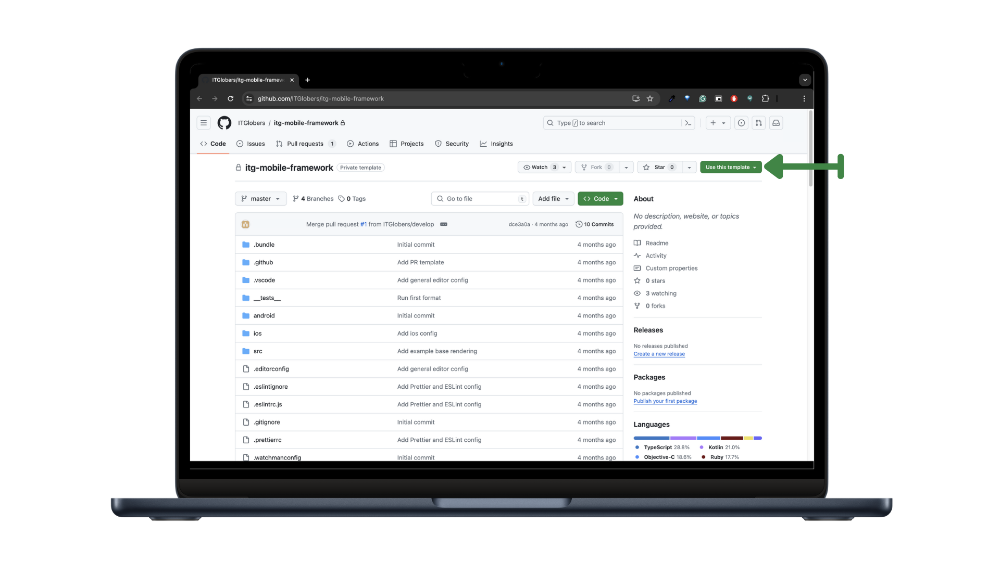

# Configuración de ambiente

Para realizar la configuración de tu ambiente, necesitarás el código base desde un repositorio de GitHub. A continuación, se detallan los pasos para descargar el código base y crear un nuevo repositorio a partir de él:

## Accede al repositorio de GitHub

Dirígete al repositorio que contiene el código base de la aplicación en GitHub. Asegúrate de tener permisos de lectura o acceso al repositorio. [https://github.com/ITGlobers/itg-mobile-framework](https://github.com/ITGlobers/itg-mobile-framework)

### Crea un nuevo proyecto con “Use this template”

En la pagina del repositorio está disponible la opción Use this template.



Esta opción te permitirá crear un nuevo repositorio basado en la estructura y archivos del repositorio original. Para empezar haz click en el botón use this template.

### Configura el nuevo proyecto

Al hacer click en use this template, se abrirá una nueva página donde deberás completar los detalles del nuevo repositorio. Esto incluye el nombre del repositorio, la descripción, la visibilidad (público o privado) y otras configuraciones opcionales.

Una vez que hayas completado los detalles del nuevo repositorio, haz clic en el botón para crear el repositorio. GitHub creará automáticamente una copia del código base en el nuevo repositorio utilizando la estructura y los archivos del repositorio original.

## Clona tu nuevo repositorio en tu sistema local

Finalmente, clona el nuevo repositorio en tu sistema local utilizando Git. Esto te permitirá trabajar en el código base de la aplicación directamente desde tu entorno de desarrollo local.

```bash
git clone <URL_del_nuevo_repositorio>
```

Ir al directorio del proyecto

```bash
cd my-project
```

Instalar dependencias

```bash
yarn
```

Ejecutar la aplicación

```bash
yarn android
yarn ios
```

Siguiendo estos pasos, podrás descargar el código base desde GitHub y comenzar a trabajar en la aplicación. Recuerda mantener el control de versiones utilizando Git y GitHub para realizar un seguimiento de los cambios y colaborar con otros miembros del equipo si es necesario.

## Próximos pasos

¡En este punto ya tienes tu ambiente listo para comenzar a desarrollar!

Si este es tu primer proyecto, te recomendamos continues con ¿Qué incluye el proyecto? para conocer como está estructurado el template que descargaste

Si ya conoces el template, puedes continuar con ¿Cómo configurar el proyecto?
